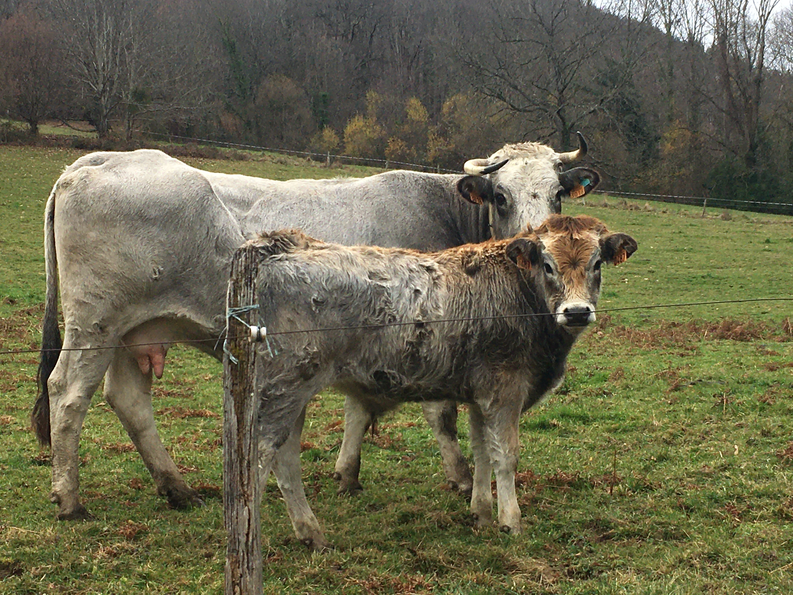

# Fundamentos matematicos de la prediccion de valores de cria.

Autor: Francisco Javier Mendizábal Múgica 

Notas de la asignatura Mejora Genética Animal. Escuela Técnica Superior de Ingenieros Agrónomos, UPNA. Pamplona-Iruña, 1994. Reescritas y corregidas por Carolina García Baccino, Fernando Macedo y Andrés Legarra, 2020. 

Creative Commons CC-BY License, derecho de copiar, distribuir, exhibir y representar la obra y hacer obras derivadas siempre y cuando reconozca y cite esta obra.

Las notas contienen aún varios errores, se aceptan sugerencias y correcciones por _git pull request_ o por mail a Andres Legarra.

El vinculo a las notas en pdf esta aqui: <https://github.com/alegarra/Fundamentos/raw/main/capitulo_all.pdf> .
